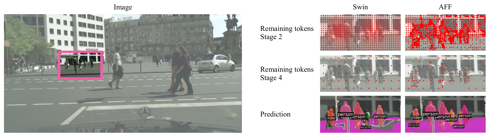
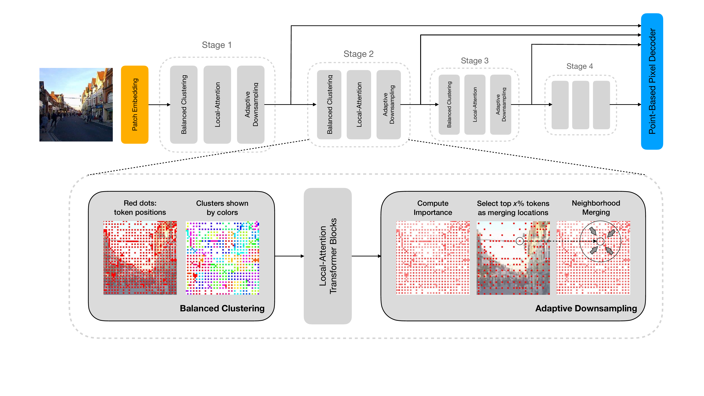
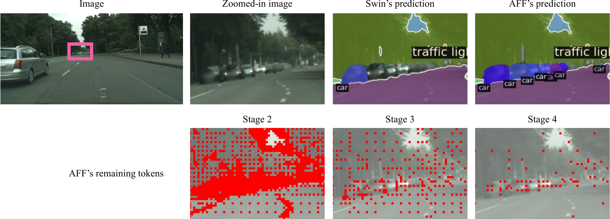
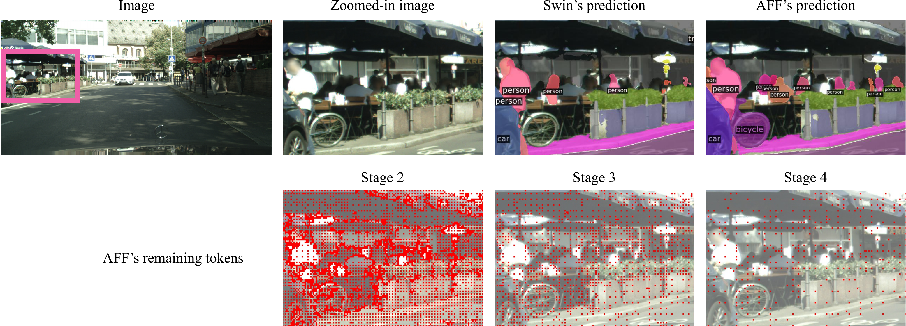

# AutoFocusFormer

[](CODE_OF_CONDUCT.md)
[](clusten/)

This software project accompanies the research paper, *AutoFocusFormer: Image Segmentation off the Grid* (CVPR 2023).

[Chen Ziwen](https://www.chenziwe.com), Kaushik Patnaik, [Shuangfei Zhai](https://scholar.google.com/citations?user=G6vdBYsAAAAJ&hl=en), [Alvin Wan](http://alvinwan.com), [Zhile Ren](https://jrenzhile.com), [Alex Schwing](https://alexander-schwing.de/), [Alex Colburn](https://www.colburn.org), [Li Fuxin](https://web.engr.oregonstate.edu/~lif/)

[arXiv](https://arxiv.org/abs/2304.12406) | [video narration](https://youtu.be/i1mZtk70yGY) | [AFF-Classification (this repo)](https://github.com/apple/ml-autofocusformer) | [AFF-Segmentation](https://github.com/apple/ml-autofocusformer-segmentation)

## Introduction

AutoFocusFormer (AFF) is the first **adaptive**-downsampling network capable of **dense** prediction tasks such as semantic/instance segmentation.

AFF abandons the traditional grid structure of image feature maps, and automatically learns to retain the most important pixels with respect to the task goal.

<div align="center">
  
</div><br/>

AFF consists of a local-attention transformer backbone and a task-specific head. The backbone consists of four stages, each stage containing three modules: balanced clustering, local-attention transformer blocks, and adaptive downsampling.

<div align="center">
  
</div><br/>

AFF demonstrates significant savings on FLOPs (see our models with 1/5 downsampling rate), and significant improvement on recognition of small objects.

Notably, AFF-Small achieves **44.0** instance segmentation AP and **66.9** panoptic segmentation PQ on Cityscapes val with a backbone of only **42.6M** parameters, a performance on par with Swin-Large, a backbone with **197M** params (saving **78%**!).

<div align="center">
  
</div><br/>

<div align="center">
  
</div><br/>

## Main Results on ImageNet with Pretrained Models 

| name | pretrain | resolution |acc@1 | acc@5 | #params | FLOPs | FPS| 1K model |
| :---: | :---: | :---: | :---: | :---: | :---: | :---: | :---: | :---: |
| AFF-Mini | ImageNet-1K | 224x224 | 78.2 | 93.6 | 6.75M | 1.08G | 1337 | [Box](https://apple.box.com/s/caro7cmxbqgmi6rw8il7x1tzrow7yx6k) |
| AFF-Mini-1/5 | ImageNet-1K | 224x224 | 77.5 | 93.3 | 6.75M | 0.72G | 1678 | [Box](https://apple.box.com/s/aib6y9l5xywo8zi3xy7gce03m4opmmyv) |
| AFF-Tiny | ImageNet-1K | 224x224 | 83.0 | 96.3 | 27M | 4G | 528 | [Box](https://apple.box.com/s/084xbpfsjpn3mkv5xiqyyls4pf3vsg6r) |
| AFF-Tiny-1/5 | ImageNet-1K | 224x224 | 82.4 | 95.9 | 27M | 2.74G | 682 | [Box](https://apple.box.com/s/vg45luh144kbcv7dukgp6tsn0qv0z7ao) |
| AFF-Small | ImageNet-1K | 224x224 | 83.5 | 96.6 | 42.6M | 8.16G | 321 | [Box](https://apple.box.com/s/yxy1gfhs4b973zvqawlrjgsi50t3fr89) |
| AFF-Small-1/5 | ImageNet-1K | 224x224 | 83.4 | 96.5 | 42.6M | 5.69G | 424 | [Box](https://apple.box.com/s/m3ylsmst93m4xtmb1v7f046ncj64zufa) |

FPS is obtained on a single V100 GPU.

We train with a total batch size 4096.

## Getting Started

### Clone this repo

```bash
git clone git@github.com:apple/ml-autofocusformer.git
cd ml-autofocusformer
```
One can download pre-trained checkpoints through the links in the table above.

### Create environment and install requirements

```bash
sh create_env.sh
```

See further documentation inside the script file.

Our experiments are run with `CUDA==11.6` and `pytorch==1.12`.

### Prepare data

We use standard ImageNet dataset, which can be downloaded from http://image-net.org/.

For standard folder dataset, move validation images to labeled sub-folders. The file structure should look like:
```bash
$ tree imagenet
imagenet/
├── training
│   ├── class1
│   │   ├── img1.jpeg
│   │   ├── img2.jpeg
│   │   └── ...
│   ├── class2
│   │   ├── img3.jpeg
│   │   └── ...
│   └── ...
└── validation
    ├── class1
    │   ├── img4.jpeg
    │   ├── img5.jpeg
    │   └── ...
    ├── class2
    │   ├── img6.jpeg
    │   └── ...
    └── ...

```

### Train and evaluate

Modify the arguments in script `run_aff.sh` (e.g., path to dataset) and run
```bash
sh run_aff.sh
```
for training or evaluation.

Run `python main.py -h` to see full documentation of the args.

One can also directly modify the config files in `configs/`.

## Citing AutoFocusFormer

```BibTeX
@inproceedings{autofocusformer,
    title = {AutoFocusFormer: Image Segmentation off the Grid},
    booktitle = {Proceedings of the IEEE Conference on Computer Vision and Pattern Recognition (CVPR)},
    author = {Ziwen, Chen and Patnaik, Kaushik and Zhai, Shuangfei and Wan, Alvin and Ren, Zhile and Schwing, Alex and Colburn, Alex and Fuxin, Li},
    year = {2023},
}
```
